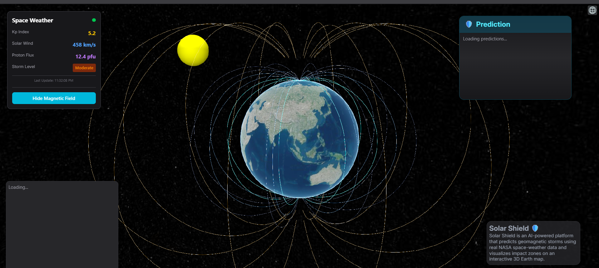

---

# **Solar Shield** 🛡️

**Solar Shield** is an AI-powered platform that predicts geomagnetic storms using real NASA space-weather data and visualizes impact zones on an interactive 3D Earth map. This project **won the NASA Space Apps Challenge – Nagpur Division Hackathon**.

## **Overview**

Solar Shield leverages real-time space weather data to provide actionable insights into solar activity, such as coronal mass ejections (CMEs), solar wind speed, proton flux, and geomagnetic storm potential. Using **CesiumJS**, it presents a 3D interactive visualization of Earth, magnetic field lines, Van Allen belts, and solar flare activity.

The platform not only predicts solar events but also sends alerts when potentially harmful space weather conditions are detected.

## **Key Features**

* **Interactive 3D Visualization**: Earth, Sun, magnetic field lines, and Van Allen belts visualized in real-time.
* **AI-Powered Prediction**: Coronal Mass Ejection (CME) data analysis with severity assessment.
* **Real-Time Dashboard**: Live KP Index, Solar Wind, Proton Flux, and Magnetic Storm indicators.
* **Alert System**: Automatic email notifications when solar activity exceeds thresholds.
* **User-Friendly Interface**: Easy-to-read prediction panel with detailed CME parameters and impact assessment.

## **Technology Stack**

* **Frontend**: React.js, CesiumJS
* **Data Fetching**: Axios
* **Styling**: Tailwind CSS
* **Backend API**: Node.js/Express (for CME predictions and alerting)

## **Usage**

1. Clone the repository:

   ```bash
   git clone https://github.com/MUCHKUNDRAJE/Team-Xebec---Nasa-Space-App-Challenge
   ```
2. Install dependencies:

   ```bash
   npm install
   ```
3. Start the development server:

   ```bash
   npm run dev
   ```
4. Open the application in a browser and explore real-time space weather predictions.

## **Screenshots**

**

## **Acknowledgements**

* NASA Space Apps Challenge – Nagpur Division Hackathon
* CesiumJS for powerful 3D geospatial visualization
* Real-time NASA space weather datasets

---

